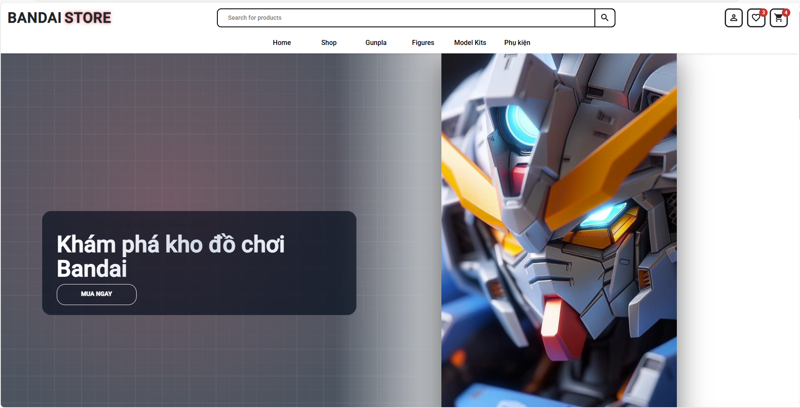
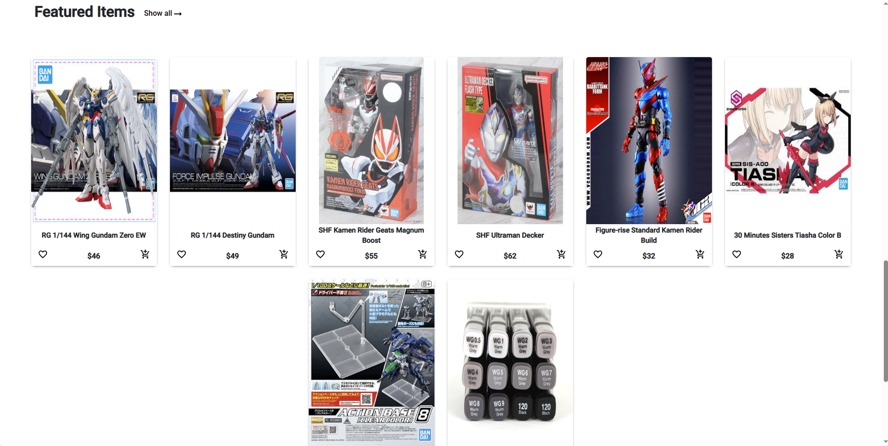
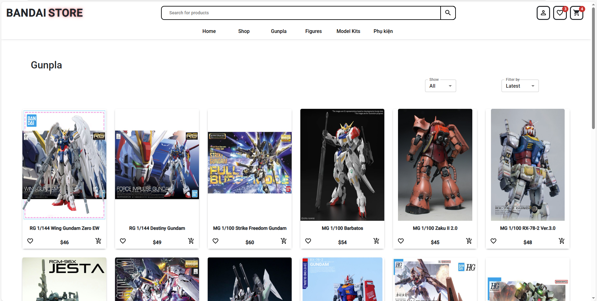
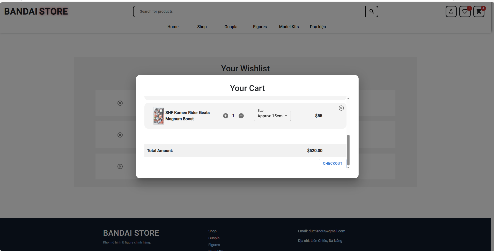
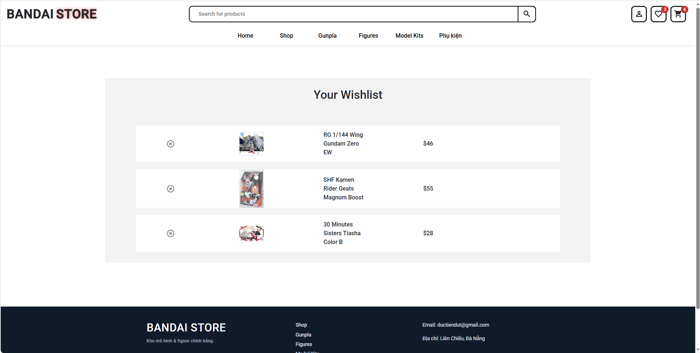

<div align="center">
  <h1>Bandai / Gundam Store (MERN)</h1>
  <strong>Full-stack ecommerce demo for scale model & figure products (Gunpla, Figures, Model Kits, Accessories)</strong><br/>
  <sub>MongoDB • Express • React 18 • Node • MUI • Bootstrap</sub>
  <br/>
  <br/>
  
  
  
  
  
  
</div>

---

## 📌 Tổng quan / Overview
Ứng dụng MERN giúp hiển thị & duyệt sản phẩm theo danh mục, xem chi tiết, thêm vào giỏ (client state), wishlist, tìm kiếm đơn giản (trong tương lai) và seed dữ liệu mẫu nhanh với script. Dự án được tối ưu để học & thử nghiệm chứ chưa phải bản production.

## ✨ Features
| Module | Highlights |
|--------|------------|
| Home | Hero banner, dynamic featured categories, curated newest items per category |
| Category Navigation | Click category → auto-scroll in unified Shop page via query parameter (`/shop?category=...`) |
| Product Cards | Second image preview on hover, quick add to wishlist/cart |
| Wishlist | In-memory wish list with badge counter |
| Cart | Modal-based cart, quantity tracking, total calculation |
| Data Seeding | Deterministic seed script with dual-image guarantee per product |
| Static Assets | Served via Express `public/` per category for simplified CDN swap later |

### Design / Architectural Decisions
- Keep cart & wishlist client-side (simple context) to focus on product browsing UX first.
- Use query parameter navigation instead of multiple category routes to reduce route complexity.
- Each product keeps an array of image metadata (future-proof for alt text / variants).
- Seed script flags (`--force`, `--append`) → predictable dev data lifecycle.
- Image naming convention: `<prefix>-<entity>-<variant>.jpg` to allow scripted validation later.

### What This Demonstrates (For CV)
- Practical context management (multiple contexts: Cart, Wishlist, Search, Featured Categories)
- Lightweight server with filtered querying (`/api/items?category=&limit=`)
- Progressive enhancement approach (fallback images, graceful loading states)
- Separation of concerns (API layer `api.js`, UI, contexts, data model)
- Extensible model schema (supports future pricing tiers / stock / attributes)

## 🗂 Cấu trúc thư mục rút gọn
```
mern-ecommerce/
  client/               # React frontend
    src/
      api.js            # Axios instance + buildImageUrl helper
      routes/            # Home, CategoryView, ItemView, Search ...
      components/        # UI components (Card, Featured, Shop, Nav...)
      Context/           # Cart, Wishlist, Search, FeaturedCategory context
  server/
    server.js           # Express app khởi động API + serve static images
    models/itemsModel.js
    controllers/itemsController.js
    routes/items.js     # /api/items (filter ?category=&limit=)
    seed.js             # Seed dữ liệu mẫu Bandai/Gundam
    public/             # Ảnh sản phẩm (gunpla/ figure/ ...)
```

## 🔧 Yêu cầu hệ thống
- Node.js >= 16
- MongoDB (Atlas hoặc local)

## ⚙️ Cấu hình môi trường (server/.env)
Tạo file `server/.env`:
```
<div align="center">
  <h1>Bandai / Gundam Store (MERN)</h1>
  <strong>Minimal portfolio-ready MERN demo for model kits & figures</strong>
  <br/>
  <sub>MongoDB · Express · React 18 · Node · MUI</sub>
</div>

## 1. Overview
Ứng dụng ecommerce demo: duyệt danh mục (Gunpla / Figures / Model Kits / Phụ kiện), xem sản phẩm, wishlist, giỏ hàng (client state), seed dữ liệu nhanh. Tập trung vào trình bày UI + kiến trúc rõ ràng thay vì đủ tính năng production.

## 2. Core Features
- Featured landing: hero + danh mục động (click → `/shop?category=...` + auto scroll)
- Product card: hover đổi ảnh, add to cart / wishlist
- Cart modal: xem nhanh, tính tổng
- Wishlist đơn giản có badge
- Seed script: 2 ảnh mỗi sản phẩm, flags `--force` / `--append`

## 3. Demo Screenshots
(Thêm các file ảnh vào `docs/` rồi cập nhật đường dẫn nếu khác.)

| Home Hero | Featured Categories | Featured Items |
|-----------|--------------------|----------------|
|  |  |  |

| Shop (Gunpla) | Cart Modal | Wishlist |
|---------------|-----------|----------|
|  |  |  |

> Bạn đã gửi ảnh demo: hãy lưu lần lượt (ví dụ) vào:  
> `docs/demo-home.png`, `docs/demo-categories.png`, `docs/demo-featured.png`, `docs/demo-shop-gunpla.png`, `docs/demo-cart.png`, `docs/demo-wishlist.png`.

## 4. Quick Start
```bash
# Backend
cd server
npm install
cp .env.example .env   # (tạo nếu chưa có) 
npm run dev

# Frontend (tab khác)
cd client
npm install
npm start
```
Mặc định API: http://localhost:5000/api

### Environment (`server/.env`)
```
NODE_ENV=development
PORT=5000
MONGO_URI=mongodb+srv://<user>:<pass>@<cluster>/<db>?retryWrites=true&w=majority
```

## 5. Seed Data
Chạy trong thư mục `server/`:
```bash
npm run seed          # tạo nếu trống
node seed.js --append # thêm item mới
node seed.js --force  # xóa & tạo lại
```
Ảnh: `server/public/<category>/<filename>`.

## 6. API (rút gọn)
| Method | Endpoint | Params | Mô tả |
|--------|----------|--------|-------|
| GET | /api/items | ?category=&limit= | Danh sách / lọc theo category |
| POST | /api/payment | amount | Placeholder demo |

## 7. Tech Stack
React 18, React Router 6, MUI, Axios, Express 4, Mongoose 6.

## 8. Folder Snapshot
```
client/      # React UI
server/      # Express API + static assets
server/public/<category>/images
server/seed.js
```

## 9. Roadmap (ngắn gọn)
- Persist cart/wishlist
- Auth + admin CRUD
- Search & filter nâng cao
- Pagination & image optimization

## 10. License
MIT (xem LICENSE).

---
Feel free to fork & extend. PRs welcome.

