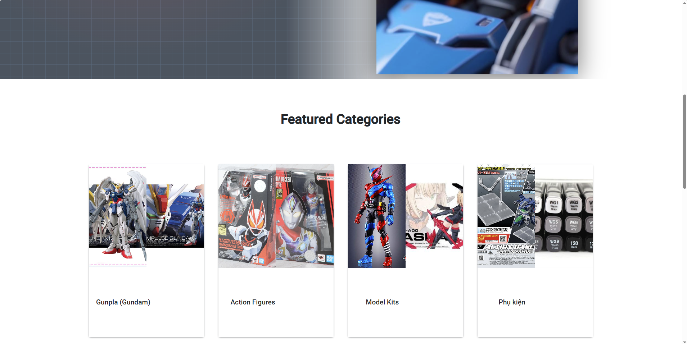

<div align="center">
  <h1>Bandai / Gundam Store (MERN)</h1>
  <strong>Lightweight ecommerce demo for model kits & figures</strong><br/>
  <sub>MongoDB · Express · React 18 · Node · MUI</sub>
  <br/><br/>
  
  
  
  
  
</div>

## 1. Demo
<p align="center">
  
</p>
<p align="center">
  
</p>
<p align="center">
  
</p>
<p align="center">
  
</p>
<p align="center">
  
</p>
<p align="center">
  
</p>

## 2. Features
- Dynamic featured categories & newest items per category
- Product card: secondary image on hover
- Quick add to cart / wishlist buttons
- Cart modal with running total
- Wishlist with badge counter
- Seed script: `npm run seed`, `node seed.js --force`, `node seed.js --append`

## 3. Quick Start
```bash
# Server
cd server
npm install
cp .env.example .env   # then edit MONGO_URI
npm run dev

# Client (new terminal)
cd client
npm install
npm start
```
Default API base: http://localhost:5000/api

## 4. Environment
`server/.env`:
```
NODE_ENV=development
PORT=5000
MONGO_URI=your_mongodb_connection_string
```
`client/.env`:
```
REACT_APP_API_BASE_URL=http://localhost:5000
```

## 5. Seed Data
```bash
cd server
npm run seed          # insert initial if empty
node seed.js --append # add only new items
node seed.js --force  # wipe & reinsert
```
Images directory: `server/public/<category>/<filename>`

## 6. API (minimal)
`GET /api/items?category=gunpla&limit=8`

## 7. Stack
React 18, React Router 6, MUI, Axios, Express 4, Mongoose 6.

## 8. Roadmap
- Persist cart & wishlist (localStorage)
- Authentication + admin CRUD
- Search, filters & pagination
- Image optimization / lazy loading

---
Built for learning & portfolio presentation.


